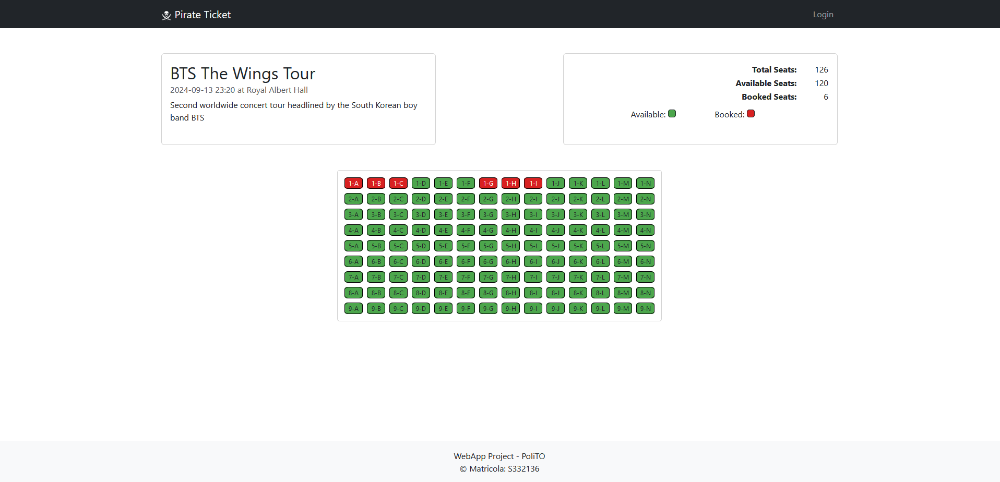
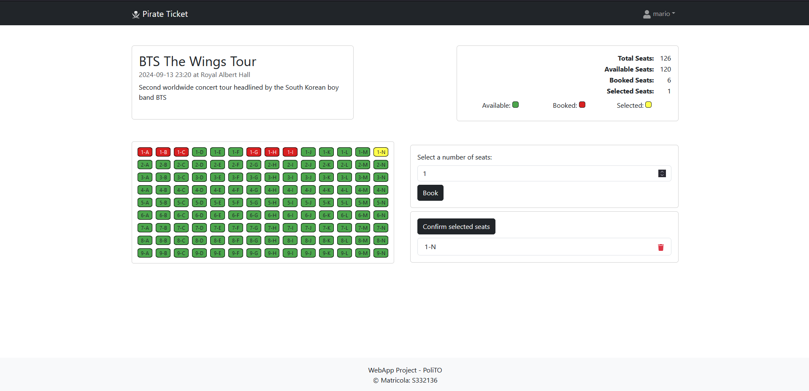

# Exam #3: "Web Applications"

## Student: s332136 Milani Aleesandro

## React Client Application Routes

- Route `/`: Home page of the website with the list of all the available concerts
- Route `/concert/:conertID`: Page of the single concert, the param: concertID is needed to recover from the database the needed informations
- Route `/login`: page that give at the use the possibility to login with email and password
- Route `/reservetions`: Page with a list of all the reservetions created by the user (with the possibility to detele each one of them)
- Route `*`: All other route lead to a NotFoundLayout

- ...

## API Server

- GET `/api/concerts`
  - Description: Get list of all concerts
  - Request body: _None_
  - Response body: Array of objects, each with a general description of a concert.

- GET `/api/concerts/:id`
  - Description: Get more details about a concert
  - Request body: _None_
  - Response body: An object with all the details of a single concert.

- GET `/api/concerts/:id/booked`
  - Description: Get booked seats for a specific concert
  - Request body: _None_
  - Response body: An object with the list of booked seats for a specific concert and the id of the concert.

- POST `/api/concerts/:id/book`
  - Description: Book a list of seats for a specific concert
  - Request body: JSON object containing `concertId` and `seats` array
  - Response body: Confirmation message with the id of the prenotation.

- GET `/api/user/booked`
  - Description: Get booked seats by user ID
  - Request body: _None_
  - Response body: Array of objects, each describing a reservation made by the user.

- DELETE `/api/user/booked/:id`
  - Description: Delete a booking by its ID
  - Request body: JSON object containing `userId`
  - Response body: A confirmation message.

- POST `/api/login`
  - Description: User login
  - Request body: JSON object containing `email` and `password`
  - Response body: User details and authentication token.

- GET `/api/auth-token`
  - Description: Get authentication token
  - Request body: _None_
  - Response body: JSON object containing the authentication token and auth level.

## API Server2

- POST `/api/discount`
  - Description: Get discount for seats
  - Request body: JSON object containing `seats` array
  - Request headers: `Authorization` with Bearer token
  - Response body: JSON object containing discount details

{.center-image width="80%"}

- Table `users` - contains user information
  - Columns:
    - `id` (INTEGER): Primary key, unique identifier for each user.
    - `email` (TEXT): Email address of the user.
    - `hash_pswd` (TEXT): Hashed password of the user.
    - `salt` (TEXT): Salt used for hashing the password.
    - `is_loyal` (INTEGER): Indicates if the user is loyal (0 or 1).

- Table `concerts` - contains concert information
  - Columns:
    - `id` (INTEGER): Primary key, unique identifier for each concert.
    - `name` (TEXT): Name of the concert.
    - `date` (TEXT): Date and time of the concert.
    - `description` (TEXT): Description of the concert.
    - `theater_id` (INTEGER): Foreign key referencing the theater where the concert is held.
    - `size_id` (INTEGER): Foreign key referencing the size of the concert.

- Table `theaters` - contains theater information
  - Columns:
    - `id` (INTEGER): Primary key, unique identifier for each theater.
    - `name` (TEXT): Name of the theater.
    - `location` (TEXT): Location of the theater.

- Table `sizes` - contains the possible sizes of theaters
  - Columns:
    - `id` (INTEGER): Primary key, unique identifier for each size.
    - `rows` (INTEGER): Number of rows in the theater.
    - `columns` (INTEGER): Number of columns in the theater.
    - `total_seat` (INTEGER): Total number of seats in the theater.

- Table `orders` - contains all the reservations made by the users
  - Columns:
    - `id` (INTEGER): Primary key, unique identifier for each order.
    - `user_id` (INTEGER): Foreign key referencing the user who made the booking.
    - `concert_id` (INTEGER): Foreign key referencing the concert being booked.
    - `seats` (TEXT): JSON string containing the list of booked seat IDs.
    - `deleted_at` (TEXT): Timestamp indicating when the booking was deleted (if applicable).

## Main React Components

- `ConcertList` (in `ConcertList.js`): Is the main Component of the Home Page, display in the correct way all the concertCards
- `ConcertPage` (in `ConcertPage.js`): Main compomnet of the page with all the details of a concert. Show all the info (name, location etc...) plus an interactive table with the available and booked seats.
- `ConcertOrder` (in `ConcertOrder.js`): Piece of the Concertpage, is displayed only when an user is Logged In and give the possibility to book seats
- `ReservetionList` (in `ReservetionList.js`): Main component of the Reservations page, display all the reservetion of a specific user
- ...
- `Layouts`, `Navbar`, `Footer`, `GenericModal` and `LoginForm` not need a particular explainetion.

## Screenshot

| No Login | Logged In | Selected Seat |
|----------|------------|---------------|
|  |  |  |

## Users Credentials

- email: <mario@nintendo.com> password: kZ2VW*et
- email: <luigi@nintendo.com> password: VRT5RUG@sv (loyal user)
- email: <link@nintendo.com>  password: AMbC%S8Grh
- email: <kojima@kojima.com>  password: Fhc!7QjATn (loyal user)
- email: <miyazaki@soul.com>  password: Te3Tcg5B@6
- email: <the-last@ofus.com>  password: 8ob%FlnYe (loyal user)
